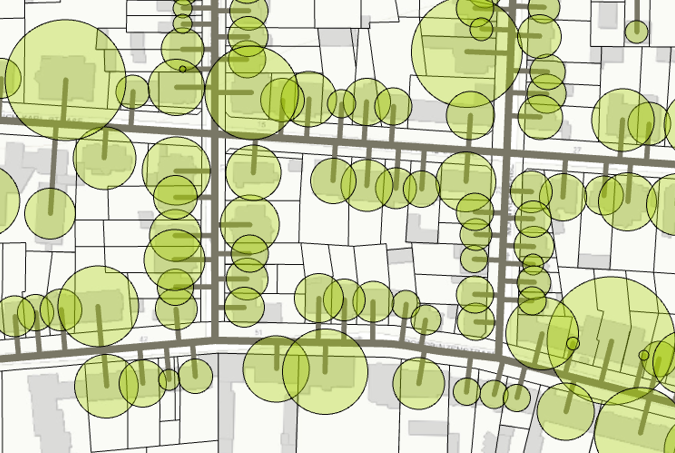

# Urban Energy & Infrastructure GIS Analysis

This repository features a series of anonymized geospatial analyses and visualizations focusing on urban energy systems, district heating, automation of network generation, and land-use zoning. By leveraging GIS and geodata techniques, this work demonstrates the application of spatial analytics to optimize city infrastructure, support sustainable urban development, and enhance decision-making processes.

## Overview

Urban areas around the world are continually evolving, requiring innovative approaches to manage energy resources efficiently. This repository highlights the use of Geographic Information Systems (GIS) and geodata techniques to create actionable insights for optimizing energy distribution networks, improving district heating systems, and facilitating smart urban planning.

### Technologies Used:
- ArcGIS Pro
- QGIS
- Python (for GIS scripting and automation)
- PostGIS/SQL (for spatial database management)
- OpenStreetMap (OSM) for public geodata
- CAD data (from municipal sources, anonymized)

### Focus Areas:
- Urban energy optimization
- Heat distribution and demand mapping
- Automated network generation
- Zoning and land-use planning

## Table of Contents
- [A: Heat Distribution Network](#a-heat-distribution-network)
- [B: Heating Demand Analysis](#b-heating-demand-analysis)
- [C: Heat Map Visualization](#c-heat-map-visualization)
- [D: Automated Network Generation](#d-automated-network-generation)
- [E: Zoning and Land Use Mapping](#e-zoning-and-land-use-mapping)
- [Methodologies](#methodologies)
- [Data Sources](#data-sources)
- [Challenges and Solutions](#challenges-and-solutions)

---

## A: Heat Distribution Network

This map models an anonymized heat distribution network, providing a blueprint for how district heating systems can be deployed across urban areas. The map visualizes thermal energy distribution and the connection between energy production facilities and consumers.

### Key Features:
- **Network Design and Simulation**: Using GIS Network Analysis tools, the system simulates how thermal energy is distributed from key sources to residential, commercial, and industrial zones.
- **Topology Management**: The network ensures that all parts of the grid are connected without errors, avoiding disconnections that could impact heat supply efficiency.
- **Sustainability Focus**: The system is modeled to integrate renewable energy sources, reflecting modern trends in decarbonizing urban energy systems.

### GIS Techniques Applied:
- **Spatial Network Creation**: Using street and building footprint data (anonymized) to construct a robust network of pipes and heat exchangers.
- **Energy Balancing**: CAPEX/OPEX simulations were conducted to visualize economic feasibility.

### Use Case:
This model provides an anonymized framework for municipal planners and engineers to simulate heat distribution, allowing for better infrastructure investment planning.

---

## B: Heating Demand Analysis

This map presents an analysis of heating demand in urban sectors using buffer zones, supporting the understanding of how proximity to heating infrastructure impacts demand.

### Key Features:
- **Demand Projection**: The analysis uses buffer zones to project energy demand in various city areas.
- **Proximity Analysis**: Buffers assess the impact of location on heat demand, helping planners prioritize network expansion.
- **Scenario Development**: Future heating needs can be projected under different urban growth scenarios.

### GIS Techniques Applied:
- **Buffer Analysis**: Proximity tools in ArcGIS calculate heat demand within certain distances from key infrastructure.
- **Demand Modeling**: Population density and building footprint data are combined with heat demand statistics for accurate projections.

### Use Case:
Municipal planners can use this model to identify high-priority zones for energy infrastructure improvements.

---

## C: Heat Map Visualization

This heat map visualizes energy demand density across an urban region, using color gradients to represent areas with varying levels of energy consumption.

### Key Features:
- **Heat Map Generation**: Kernel density estimation tools highlight energy consumption intensity.
- **Raster Analysis**: The heat map interpolates point data into a continuous surface, showing demand levels across the area.
- **Data-Driven Decision Making**: This helps prioritize investments in energy efficiency measures.

### GIS Techniques Applied:
- **Kernel Density Estimation**: Point data is transformed into a raster heat map to display demand intensity.
- **Spatial Interpolation**: Energy consumption data is interpolated to create a smooth demand surface.

### Use Case:
This heat map helps urban planners and energy providers prioritize investment in energy-efficient technologies.

---

## D: Automated Network Generation

This visualization demonstrates an automated network generation workflow, using GIS tools to design heating infrastructure based on spatial data.

### Key Features:
- **Automatic Network Generation**: GIS automation generates heat distribution networks based on building locations and street layouts.
- **Topology Rules**: Applied to ensure that automatically generated networks are error-free and follow existing infrastructure.
- **Data Cleaning and Preprocessing**: Ensures the success of network generation algorithms.

### GIS Techniques Applied:
- **Automated Routing**: Custom Python scripts trace streets and connect buildings with minimal manual intervention.
- **Preprocessing**: Data is cleaned and preprocessed to ensure efficient network generation.

### Use Case:
This workflow demonstrates how GIS automation reduces the time and cost associated with planning large-scale energy networks.

---

## E: Zoning and Land Use Mapping

This map shows an anonymized zoning and land-use classification, depicting how urban areas are divided into residential, commercial, industrial, and green spaces.

### Key Features:
- **Land Use Classification**: Using cadastral and municipal data, the map classifies different areas into land-use zones, color-coded for clarity.
- **Zoning and Energy Planning**: Energy demand data is integrated with zoning information to aid in infrastructure development planning.

### GIS Techniques Applied:
- **Symbology**: Different symbols and colors differentiate between land-use zones.
- **Zoning Data Integration**: Land-use and zoning data are integrated into energy infrastructure planning for a comprehensive view of urban development.

### Use Case:
This zoning map provides a template for cities to plan energy infrastructure in alignment with zoning regulations and urban growth strategies.
